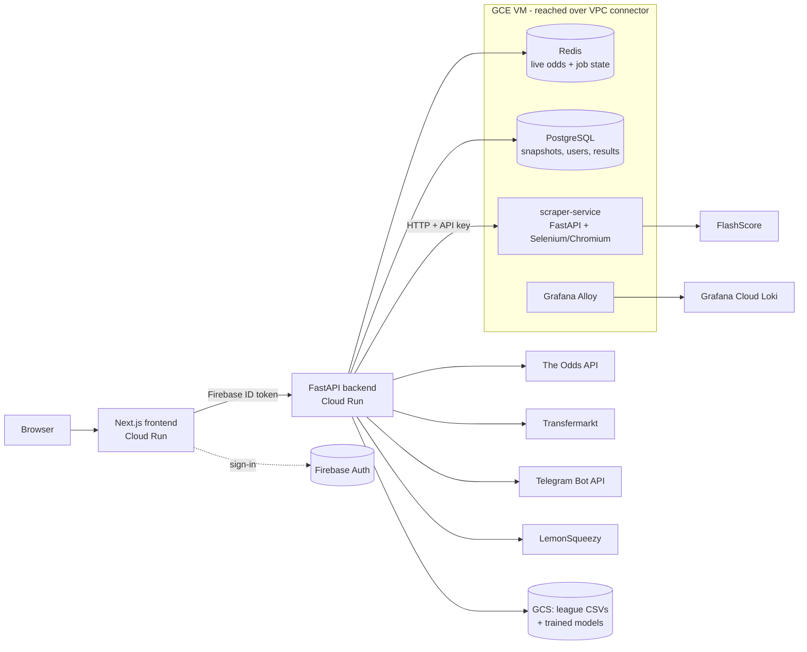

# Sharper Bets

A sports intelligence platform that tracks live betting odds, compares squads by player market value, and predicts football results with a Dixon-Coles model.


## Overview

I built Sharper Bets for three things I wanted in one place when looking at a match:

1. **Track a match**: follow how the odds move from the moment tracking starts until kickoff, then record the final result.
2. **Compare the teams**: line up both squads position by position by Transfermarkt market value.
3. **Predict the outcome**: get model-based probabilities to support the decision instead of relying on gut feeling.

It is a full SaaS: Firebase sign-in, free and premium tiers with quotas, LemonSqueezy billing, Telegram alerts for premium users, and an admin dashboard. It runs on GCP.

<!-- TODO(Ayoub): results/metrics — e.g. matches tracked, snapshots stored, users, model calibration or accuracy on held-out matches. -->

## Key features

- **Live odds tracking (football and tennis)**: FlashScore odds are scraped with Selenium, each tracked match gets its own APScheduler job, recent history is kept in Redis, and durable snapshots go to PostgreSQL. Supported markets are 1X2 and Over/Under 2.5.
- **Sharp-line reference**: when an Odds API key is configured, Pinnacle prices are fetched alongside the scraped book and used as the primary line.
- **Resilient scheduling**: on restart, tracking and result-polling jobs are restored from Redis/Postgres with staggered start times so they don't all hit the sources at once.
- **Result capture**: after kickoff, a separate job polls final scores so each match's odds history is paired with its outcome, and a per-match dataset can be exported.
- **Dixon-Coles predictions**: per-league models trained on historical match CSVs (11 leagues included) return 1X2 probabilities, expected goals, the most likely scoreline and BTTS. Models are stored on the local filesystem or in Google Cloud Storage.
- **Squad comparison**: position-by-position market-value comparison of two clubs, built on Transfermarkt scrapers, with progress reporting and caching.
- **Telegram alerts**: premium users link their account through a one-time deep link and set a movement threshold. Duplicate alerts are suppressed with a cooldown, and webhook calls are verified with a shared secret.
- **Tiered access**: `normal`, `premium` and `admin` roles with daily and concurrent quotas. Premium matches are polled every 10 minutes instead of 45.
- **Billing**: LemonSqueezy checkout, customer portal and HMAC-verified webhooks that upgrade or downgrade the user's role.
- **Admin tools**: platform dashboard (users, tracking load, Odds API usage) and league CSV upload plus model retraining from the browser.
- **Observability**: structured JSON logs tagged by component, shipped to Grafana Cloud Loki through Grafana Alloy.

| Dixon-Coles prediction | Admin dashboard |
|---|---|
|  |  |

## Architecture



The FastAPI backend is stateless and runs on Cloud Run. Redis and PostgreSQL live on a GCE VM that Cloud Run reaches through a VPC connector. Browser scraping runs in a separate `scraper-service` container on the same VM, which keeps Chromium out of the API image and lets the API scale on its own. In local development the backend can instead drive Chrome directly. Each push to `master` deploys only the components it touched, through three GitHub Actions workflows (backend, frontend, scraper) that authenticate to GCP with Workload Identity Federation instead of stored keys.

## Tech stack

| Area | Technologies |
|---|---|
| **Backend** | Python 3.12, FastAPI, SQLAlchemy, APScheduler, pandas, SciPy, Selenium, BeautifulSoup/lxml, httpx, slowapi, Firebase Admin SDK |
| **Frontend** | Next.js 15 (App Router), React 19, TypeScript, Tailwind CSS 4, Chart.js, Firebase Auth, Axios |
| **Data** | PostgreSQL 16, Redis 7, Firestore (waitlist), Google Cloud Storage |
| **Infra** | Docker, GCP Cloud Run, Compute Engine, Artifact Registry, Secret Manager, GitHub Actions, Grafana Cloud (Loki + Alloy) |
| **Integrations** | FlashScore, The Odds API, Transfermarkt, Telegram Bot API, LemonSqueezy |

## Getting started

### Prerequisites

- Python 3.12
- Node.js 20+
- Docker (for Redis and PostgreSQL)
- A Firebase project with Authentication enabled, plus a **service-account JSON** for the backend and the **web app config** for the frontend
- Google Chrome, only if you want to scrape odds without running `scraper-service`

### 1. Start Redis and PostgreSQL

The backend won't start without both. It restores tracking jobs from Redis on boot, and it creates its tables in PostgreSQL.

```bash
docker compose up -d redis postgres
```

### 2. Backend

```bash
cd transfermarkt-api
python -m venv .venv
source .venv/bin/activate          # Windows: .venv\Scripts\activate
pip install -r requirements.txt

cp .env.example .env               # then set GOOGLE_APPLICATION_CREDENTIALS
uvicorn main:app --host 127.0.0.1 --port 9000 --reload
```

Run it from inside `transfermarkt-api/`, because `.env` is loaded relative to the working directory. Tables are created on startup, so there is no separate migration step. API docs are at http://localhost:9000/api/docs.

Environment variables are documented in [`transfermarkt-api/.env.example`](transfermarkt-api/.env.example). Only `GOOGLE_APPLICATION_CREDENTIALS`, `DATABASE_URL` and `REDIS_HOST` are needed to boot. The Odds API, Telegram and LemonSqueezy keys enable optional features. Add your email to `ADMIN_EMAILS` to get the admin role on first sign-in.

### 3. Scraper (for odds tracking)

Choose one:

- **Scraper service**: run it in a second terminal, then set `SCRAPER_SERVICE_URL=http://localhost:9001` in the backend `.env`.
  ```bash
  cd scraper-service
  pip install -r requirements.txt
  uvicorn main:app --port 9001
  ```
- **In-process**: leave `SCRAPER_SERVICE_URL` blank and the backend drives a local Chrome directly.

### 4. Frontend

```bash
cd frontend-bet
npm ci
cp .env.example .env.local         # fill in your Firebase web config
npm run dev
```

The app runs at http://localhost:3000.

### 5. Seed prediction models

Historical match CSVs for 11 leagues ship in `transfermarkt-api/app/data/leagues/`. Trained models aren't committed, so train them once, either from **Admin → Dixon-Coles** in the UI or through the API with an admin token:

```bash
curl -X POST http://localhost:9000/api/predictions/train \
  -H "Authorization: Bearer <firebase-id-token>" \
  -H "Content-Type: application/json" \
  -d '{"league_name": "serie_a"}'
```

## Project structure

```
.
├── transfermarkt-api/       # FastAPI backend
│   ├── app/api/endpoints/   #   routers: odds, predictions, clubs, players, telegram, billing, admin
│   ├── app/services/        #   odds tracker, Dixon-Coles, scrapers, Odds API client, Telegram
│   ├── app/models/          #   SQLAlchemy + Pydantic models, market registry
│   ├── app/core/            #   auth, tier quotas, LemonSqueezy, logging
│   ├── app/data/leagues/    #   historical match CSVs used for training
│   └── tests/               #   pytest suite
├── frontend-bet/            # Next.js frontend (dashboard, odds, track, predictions, admin)
├── scraper-service/         # Selenium/Chromium scraping microservice for the GCE VM
├── observability/           # Grafana Alloy config, dashboard, GCP log-routing setup
├── .github/workflows/       # CI/CD: backend + frontend → Cloud Run, scraper → GCE
├── docker-compose.yml       # local stack (API, frontend, Redis, Postgres)
└── docker-compose.gce.yml   # production VM stack (Redis, Postgres, scraper, Alloy)
```

## Testing

```bash
cd transfermarkt-api
pip install pytest schema          # test-only dependencies
pytest tests
```

The suite covers odds persistence and fallbacks, primary-odds resolution, match results, the Odds API client, the market registry, Telegram alert thresholds and deduplication, and the admin endpoints. Tests use in-memory SQLite and fakes for Redis and Telegram, so they need no running services.

## Status & next steps

The platform is deployed and in use. Known gaps:

- **Tests**: `pytest tests` currently reports 189 passed, 6 failed and 11 errors. The Telegram pipeline tests' fake Redis lacks `incr`, and the club scraper tests depend on fixtures that no longer exist. The player and competition test files are empty placeholders.
- **Migrations**: schema changes are applied as idempotent `ALTER TABLE` statements at startup. The Alembic setup under `app/models/alembic/` is partial.
- **Local Docker Compose**: the stack doesn't include `scraper-service`, and the frontend container isn't passed its Firebase build args.

<!-- TODO(Ayoub): next steps you plan, e.g. more markets, more sports, model evaluation/backtesting against closing odds. -->

<!-- TODO(Ayoub): lessons learned — e.g. splitting Chromium into its own service, scheduler recovery after restarts, scraping reliability. -->

## Acknowledgements

The Transfermarkt scraping layer started from [felipeall/transfermarkt-api](https://github.com/felipeall/transfermarkt-api) (MIT) as a base. Everything built on top of it is my own work: the league data, extended scraping, odds tracking, predictions and the SaaS platform.

## Author

**Ayoub Ennaoui**: [LinkedIn](https://www.linkedin.com/in/ayoub-ennaoui)
